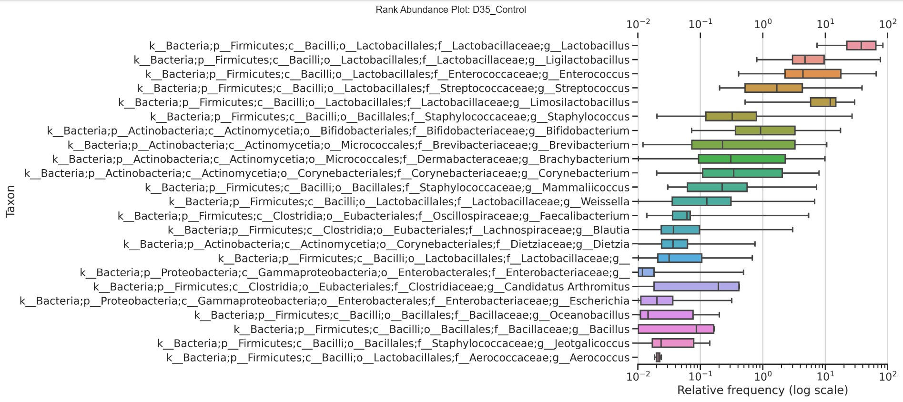

# Qiime2 Plugin: Rank Abundance Boxplot

#### Python package for the Qiime2 framework to generates Rank Abundance Boxplots visualization
This QIIME 2 plugin produces a rank abundance plot inspired by the Whittaker curve concept, where the taxa relative frequencies are ranked by maxima and represented on a log-scale for readability 
##### Install from local path (cloned repo)
``` 
make install 
```

##### Qiime2 CLI usage example  
```
qiime rank-abundance boxplot \
--i-collapsed-table collapsed_feature_table.qza \
--m-metdata-file metadata.tsv \
--p-group-column "column name" \
--o-visualization rank_abundance_boxplot.qzv
```

If the optional `--p-group-column` parameter was ommited the output will generate a rank abundance plot from all sample data.   
However, if a valid metadata column name was provided, the plugin will generate a rank abundance plot for each category in the column (e.g., control, treatment groups)  
NOTE: a non-collapsed feature can be provided, in which case the taxa labels will be the default NCBI taxids used by qiime feature table artifacts



